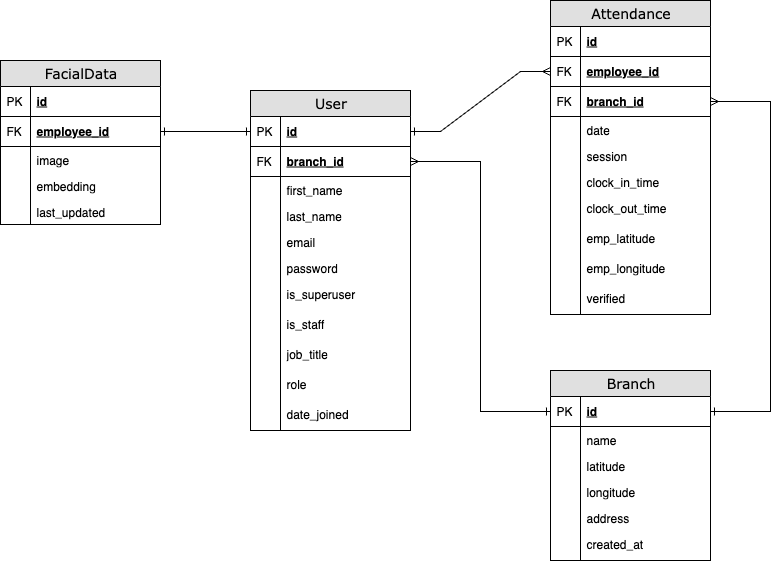

# 📌 Employee Attendance System

## 📑 Contents
- [1. Overall](#1-overall)
- [2. Functional Requirements](#2-functional-requirements)
  - [User Roles](#👨‍💼-user-roles)
  - [Core Features](#🛠-core-features)
- [3. Tech Stack](#3-tech-stack)
  - [Frontend](#🖥️-frontend)
  - [Backend](#⚙️-backend)
  - [Deployment & Tools](#📦-deployment--tools)
- [4. ER Diagram](#4-er-diagram)

---

## 1. Overall  
The **Employee Attendance System** is a web-based platform that enables organizations to efficiently manage employee attendance records. It allows HR staff to monitor attendance history, track check-in/check-out times, manage employees, and register employee facial data. Employees can log in to clock in/out and view their own attendance records. 

---

## 2. Functional Requirements  

### 👨‍💼 User Roles  
- **Website Admin (SuperUser Role)**  
  - Manage branches of company (add, edit, delete)  
  - Manage HR admin (add, edit, delete)  
  - Manage employees (add, edit, delete)    
  
- **HR Admin (HR Role)**  
  - Manage employees (add, edit some fields)  
  - Register employees facial data  
  - View attendance records for all employees 

- **Employees (User Role)**  
  - Record daily attendance (check-in/check-out)  
  - View their own attendance history  
  - Change their password

### 🛠 Core Features  
- **User Authentication & Authorization** (HR vs Employee roles).  
- **Attendance Tracking** (check-in, check-out, working hours calculation).  
- **Branch & Department Management**.  
- **Responsive Dashboard** for both Website Admin and HR Admin.  

---

## 3. Tech Stack  

### 🖥️ Frontend  
- **React.js with Vite**  
- **Tailwind CSS**  
- **Heroicons**  

### ⚙️ Backend  
- **Django (Django REST Framework)**  
- **JWT Authentication**  
- **DeepFace (VGG-Face)**  
- **Geopy**  
- **PostgreSQL**  
  
### 📦 Deployment & Tools  
- **Hetzner**  
- **GitHub**  

---

## 4. ER Diagram  

